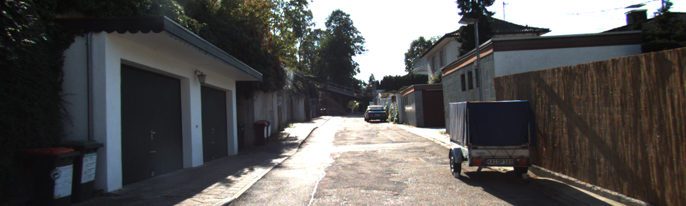
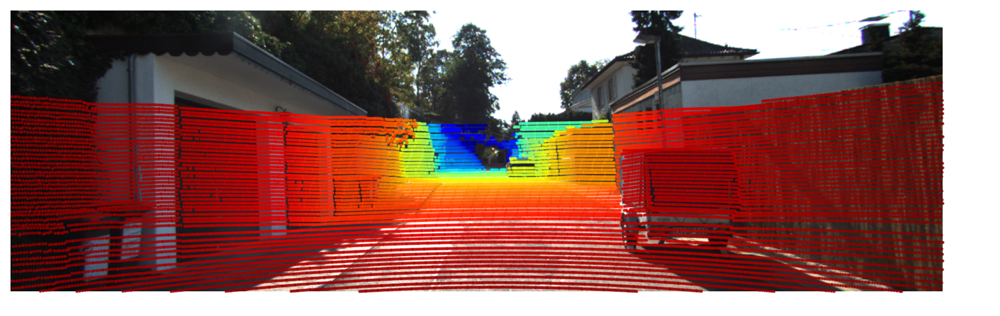

# KITTI 3D Point-Cloud Projector

Implementation with only NumPy to demonstrate core spatial computing skills.

**Tech:** Python, NumPy, Matplotlib  
**Dataset:** KITTI 3D Object Detection (raw Velodyne & calib)

## Samples
Using 000002 from the KITTI Dataset  
**Original**

**Plotted**

## Quickstart
1. `pip install -r requirements.txt`
2. Download KITTI samples (2017 3D Object Detection Evaluation)
3. `python3 main.py`
4. Check outputs folder for overlaid images